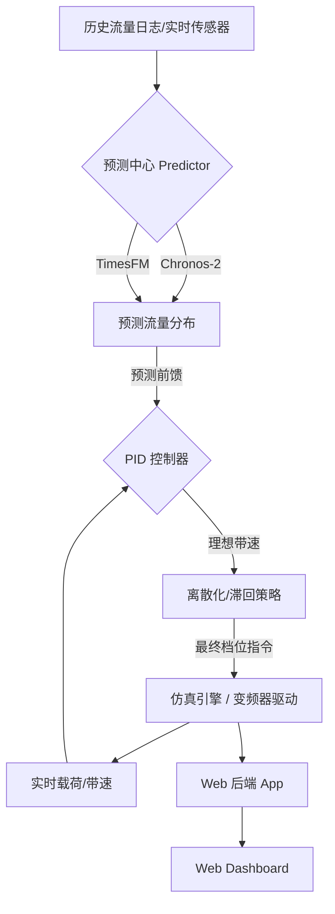

# 🏗️ TLM: 煤流输送仿真与智能调速决策系统

**Traffic & Logistics Management for Coal Conveyor Systems**

[](https://www.python.org/downloads/)
[](https://opensource.org/licenses/MIT)
[](https://flask.palletsprojects.com/)

TLM 是一个专为煤矿胶带输送线设计的**集约化节能调速系统**。它集成了**实时物理建模仿真**、**深度学习流量预测**（双模型支持）以及**高稳定性离散 PID 控制策略**，旨在通过精准调速实现皮带机的稳态节能并降低机械磨损。

---

## 🔥 核心特性

### 1. 🧠 双引擎流量预测 (Traffic Forecasting)
- **多模型支持**: 系统内置异步推理引擎，支持 **Amazon Chronos-2** 与 **Google Research TimesFM (2.5)** 预训练大模型。
- **动态视野**: 基于最近 60 个采样点的实时滑动窗口，预测未来 10 步的流量分位数分布 (0.1, 0.5, 0.9)，提供决策预见性。

### 2. 🎮 稳态离散 PID 调速 (Discrete Speed Control)
- **前馈+反馈机制**: 结合 Chronos/TimesFM 的预测前馈与实测皮带载荷的闭环反馈。
- **积分优化**: 针对离散档位导致的量子化误差，采用“基于理想连续状态”的积分策略，彻底消除档位频繁跳动的“极限环”震荡。
- **机械保护**: 内置“中点滞回” (Middle-Point Hysteresis) 与“状态驻留” (Dwell Time Limit) 约束，最大限度平衡能效与机械寿命。

### 3. 📊 工业级实时看板
- **低延迟仿真**: 基于 Flask 的 Web 后端配合前端可视化，实时同步流量分布、带速档位、瞬时负载及节能曲线。
- **多路数据回放**: 支持加载历史采集日志，模拟多级皮带机的动态煤流叠加效应。

---

## 🛠️ 系统架构



---

## 📂 目录结构 (精简版)

| 模块 | 说明 |
| :--- | :--- |
| `run_web.py` | **主启动程序**: 同时开启仿真、预测与 Web 服务。 |
| `src/core/` | **核心模块**: 包含配置 (`config`), PID 算法 (`pid`), 数据解析 (`data`), 仿真逻辑 (`simulator`)。 |
| `src/predict/` | **预测中心**: 抽象推理接口，支持多后端切换。 |
| `src/web/` | **交互层**: 包含 API 后端、CLI 命令行工具及前端资源。 |
| `data/` | 物理设备采集的原始流量日志 (`.txt`)。 |
| `models/` | 预训练模型权重存储 (支持本地加载)。 |
| `docs/` | 包含控制策略、算法细节等详细设计说明文档。 |

---

## 🚀 快速开始

### 1. 环境准备
推荐使用 **Python 3.10+** 的虚拟环境。

```bash
# 克隆仓库
git clone <your-repo-url>
cd TLM

# 安装基础依赖
pip install -r requirements.txt

# (可选) 若需切换 TimesFM 后端，请参考 src/predict/predictor.py 的安装建议
```

### 2. 模型部署
本项目默认在 `models/chronos-2/` 中查找权重。如果没有，系统将尝试从网络自动拉取（需能访问 HuggingFace）。

### 3. 启动系统
执行根目录下的启动脚本：

```bash
python run_web.py
```

访问 `http://localhost:5173` 即可进入监控仪表盘。

---

## ⚙️ 核心配置

在 `src/core/config.py` 中，你可以调整：
- `PREDICT_BACKEND`: 切换推理引擎 (`chronos` 或 `timesfm`)。
- `L_OPT`: 皮带运行的目标最优线密度（默认为 0.15 t/m）。
- `GEARS`: 离散转速档位定义（例如 `[1.5, 2.5, 3.5, 4.5]`）。

---

## 📝 许可证

本项目遵循 [MIT License](LICENSE) 许可。仅供学术研究、仿真演示及技术预览使用。
