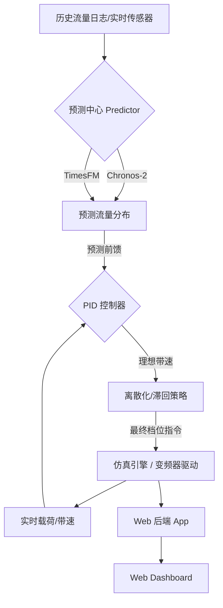

# 🏗️ TLM: 煤流输送仿真与智能调速决策系统

**Traffic & Logistics Management for Coal Conveyor Systems**

[](https://www.python.org/downloads/)
[](https://opensource.org/licenses/MIT)
[](https://flask.palletsprojects.com/)

TLM 是一个专为煤矿胶带输送线设计的**集约化节能调速系统**。它集成了**实时物理建模仿真**、**深度学习流量预测**（双模型支持）以及**高稳定性离散 PID 控制策略**，旨在通过精准调速实现皮带机的稳态节能并降低机械磨损。

---

## 🔥 核心特性

### 1. 🧠 双引擎流量预测 (Traffic Forecasting)
- **多模型支持**: 系统内置异步推理引擎，支持 **Amazon Chronos-2** 与 **Google Research TimesFM (2.5)** 预训练大模型。
- **动态视野**: 基于最近 60 个采样点的实时滑动窗口，预测未来 10 步的流量分位数分布 (0.1, 0.5, 0.9)，提供决策预见性。

### 2. 🎮 稳态离散 PID 调速 (Discrete Speed Control)
- **前馈+反馈机制**: 结合 Chronos/TimesFM 的预测前馈与实测皮带载荷的闭环反馈。
- **积分优化**: 针对离散档位导致的量子化误差，采用“基于理想连续状态”的积分策略，彻底消除档位频繁跳动的“极限环”震荡。
- **机械保护**: 内置“中点滞回” (Middle-Point Hysteresis) 与“状态驻留” (Dwell Time Limit) 约束，最大限度平衡能效与机械寿命。

### 3. 📊 工业级实时看板
- **低延迟仿真**: 基于 Flask 的 Web 后端配合前端可视化，实时同步流量分布、带速档位、瞬时负载及节能曲线。
- **多路数据回放**: 支持加载历史采集日志，模拟多级皮带机的动态煤流叠加效应。

---

## 🛠️ 系统架构



---

## 📂 目录结构 (精简版)

| 模块 | 说明 |
| :--- | :--- |
| `run_web.py` | **主启动程序**: 同时开启仿真、预测与 Web 服务。 |
| `src/core/` | **核心模块**: 包含配置 (`config`), PID 算法 (`pid`), 数据解析 (`data`), 仿真逻辑 (`simulator`)。 |
| `src/predict/` | **预测中心**: 抽象推理接口，支持多后端切换。 |
| `src/web/` | **交互层**: 包含 API 后端、CLI 命令行工具及前端资源。 |
| `data/` | 物理设备采集的原始流量日志 (`.txt`)。 |
| `models/` | 预训练模型权重存储 (支持本地加载)。 |
| `docs/` | 包含控制策略、算法细节等详细设计说明文档。 |

---

## 🚀 安装与运行指南

### 1. 环境要求

- **Python**: 建议使用 **Python 3.10 ~ 3.12**（高于 3.12 的版本可能与部分依赖不兼容）。
- **操作系统**: Windows / Linux / macOS 三平台均可；示例命令以 `bash`/PowerShell 为主。
- **GPU (可选)**: 若使用 Chronos-2 / TimesFM 的 GPU 推理，请准备支持 CUDA 的 NVIDIA 显卡与匹配的 PyTorch 发行版。

### 2. 创建虚拟环境

推荐使用 `venv` 或 `conda` 管理依赖，避免污染全局 Python：

```bash
# 以 venv 为例
python -m venv .venv
source .venv/bin/activate  # Windows PowerShell: .venv\Scripts\Activate.ps1
```

或：

```bash
# 以 conda 为例
conda create -n tlm python=3.10 -y
conda activate tlm
```

### 3. 获取代码与安装依赖

```bash
# 克隆仓库
git clone <your-repo-url>
cd TLM

# 安装基础依赖
pip install -r requirements.txt
```

`requirements.txt` 中只包含 Web 仿真与 Chronos-2 推理的必要依赖；如需启用 TimesFM 后端，请参考下文「可选：安装 TimesFM」。

### 4. 准备数据与模型

- **历史流量日志**
  - 默认从 `data/` 目录加载，文件名形如 `<date>.txt`，例如：
    - `data/20250512.txt`（对应 `WebConfig.LANE0_DATE`）
    - `data/20250514.txt`（对应 `WebConfig.LANE1_DATE`）
  - 日志格式示例可参考现有样本；解析逻辑见 `src/core/data.py`。

- **Chronos-2 模型（默认后端）**
  - 默认从 `models/chronos-2/` 目录加载。
  - 若本地不存在，代码会按 Chronos 官方方式从 HuggingFace 自动拉取（需要外网与 HuggingFace 访问权限）。
  - 如需离线部署，可提前下载权重放入该目录，保持目录结构与官方一致。

### 5. 可选：安装 TimesFM 预测后端

TimesFM 在官方实现上对 Python 版本有一定约束，建议在 **Python 3.10 ~ 3.12** 的环境中单独安装：

```bash
# 仅在需要 TimesFM 时执行
git clone https://github.com/google-research/timesfm.git
cd timesfm
pip install -e .[torch]
```

安装完成后：

1. 将 TimesFM 2.5 的本地权重目录放到仓库的 `models/timesfm-2.5-200m-pytorch/` 下（或在 `WebConfig.TIMESFM_MODEL_NAME` 中调整路径）。
2. 修改 `src/core/config.py` 中的：

   ```python
   PREDICT_BACKEND = "timesfm"  # 默认为 "chronos"
   ```

预测器初始化时若发现 TimesFM 不可用，会自动打印详细提示并回退到 Chronos-2，不会影响 Web 仿真正常启动。

### 6. 启动 Web 仿真与仪表盘

确保当前目录为项目根目录（包含 `run_web.py`）：

```bash
python run_web.py
```

终端会依次输出：

- 日志文件加载情况（每路样本条数与断点数量）
- 预测器后台加载状态（Chronos-2 或 TimesFM）
- Flask Web 服务监听的地址与端口（默认 `http://localhost:5173`，端口由 `WebConfig.PORT` 控制）

浏览器访问对应地址即可进入实时监控仪表盘，查看：

- 双工况对比（额定常速 vs AI 智能调速）的节能率
- 主皮带线密度、累计进出量、带速档位时间序列
- 每一路工作面的历史流量与未来预测分位数曲线

---

## ⚙️ 核心配置

在 `src/core/config.py` 中，你可以调整：
- `PREDICT_BACKEND`: 切换推理引擎 (`chronos` 或 `timesfm`)。
- `L_OPT`: 皮带运行的目标最优线密度（默认为 0.15 t/m）。
- `GEARS`: 离散转速档位定义（例如 `[1.5, 2.5, 3.5, 4.5]`）。

---

## 📝 许可证

本项目遵循 [MIT License](LICENSE) 许可。仅供学术研究、仿真演示及技术预览使用。
