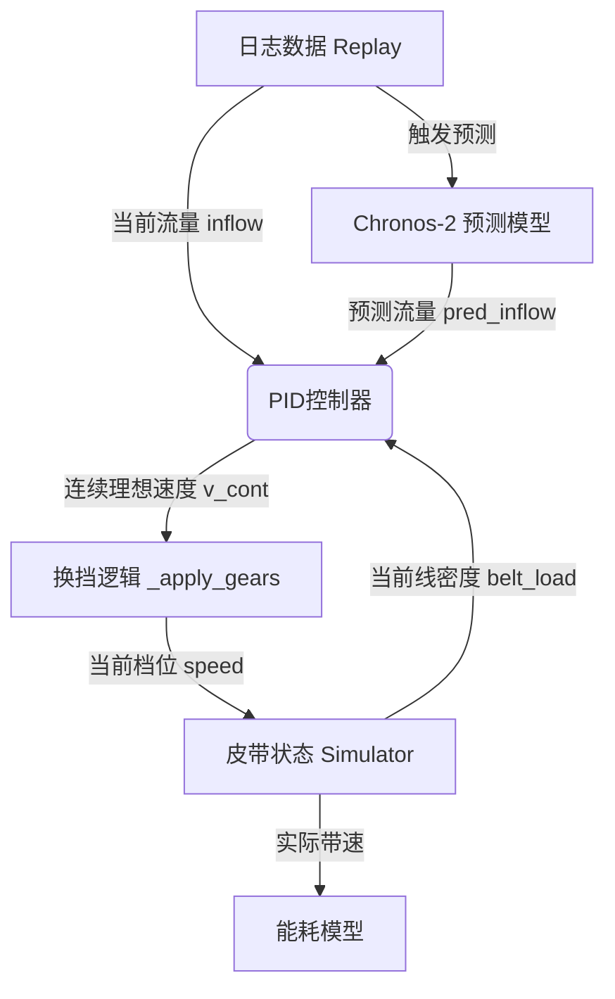

# 速度控制策略文档

## 1. 概述

本系统采用基于**PID控制**与**AI预测前馈**相结合的智能调速策略，旨在根据皮带煤流动态调整带速，实现**节能降耗**与**防堵保护**的双重目标。

### 1.1 设计哲学

1.  **离散档位控制**：工业电机通常不能无级调速，本系统模拟了5个离散速度档位，通过滞回机制防止频繁换挡。
2.  **前馈-反馈复合控制**：
    *   **前馈（Feedforward）**：基于当前流量和未来预测流量计算理论带速，实现"未雨绸缪"。
    *   **反馈（Feedback）**：基于皮带实际线密度（载荷密度）进行修正，防止局部拥堵。
3.  **安全优先**：当检测到局部煤量过高（涌堵风险）时，强制提升带速，优先保障运输安全。

---

## 2. 系统架构

速度控制模块位于仿真循环的核心，数据流如下：



---

## 3. 速度档位配置

系统定义了5个离散速度档位，配置文件：[src/core/config.py](../src/core/config.py)

```python
SPEED_GEARS = [1.5, 2.25, 3.0, 3.75, 4.5]
```

| 档位 | 速度 (m/s) | 典型流量 (t/h) | 占比 (相对于额定) |
| :--- | :--- | :--- | :--- |
| 1档 (Low) | 1.50 | ~1500 | 33% |
| 2档 | 2.25 | ~2250 | 50% |
| 3档 | 3.00 | ~3000 | 67% |
| 4档 | 3.75 | ~3750 | 83% |
| 5档 (High) | 4.50 | ~4500 | 100% |

* **ACTUAL_SPEED = 4.5**：额定带速，对应电机最高转速。

---

## 4. PID 控制算法

核心实现位于 [src/core/pid.py](../src/core/pid.py) 的 `PIDStrategy` 类。

PID控制器接收当前流量、预测流量和皮带负载，输出一个**连续的理想带速**（1.5 ~ 4.5 m/s）。

### 4.1 紧急升速机制 (Safety Override)

在常规PID计算之前，首先检查皮带上的最大局部线密度 `s_max`。

*   **加权计算**：皮带入料端（前端）的权重高于出料端，因为入料端拥堵更容易导致堆煤。
    ```python
    w = np.linspace(1.0, 0.2, len(belt_load))
    s_max = np.max(belt_load * w)
    ```
*   **触发条件**：当 `s_max > L_OPT * 1.5` (即 > 0.225 t/m) 时。
*   **响应动作**：无视其他计算，直接以最大速率 (0.15 m/s per step) 提升当前速度，清空积分项，防止堵料。

### 4.2 前馈控制 (Feedforward)

利用预测信息提前调整速度。

```python
ref = max(inflow, float(np.max(pred_inflow)))
v_flow = (ref * CELL_SIZE) / (L_OPT * 0.90)
```

*   `ref`：取当前流量和未来预测流量的最大值。
*   `L_OPT`：目标线密度 (0.15 t/m)。
*   `0.90`：带宽利用率系数。

### 4.3 反馈修正 (Feedback)

当线密度超过目标值时，强制提升目标速度，防止煤流堆积。

```python
excess_ratio = (s_max - L_OPT) / (0.5 * L_OPT)
v_feedback = V_MIN + excess_ratio * (V_MAX - V_MIN)
```

最终目标速度取前馈和反馈中的较大值：`ideal = max(v_flow, v_feedback)`。

### 4.4 积分与平滑

*   **积分项**：用于消除稳态误差。当速度误差小于2%时，积分项自动衰减（Anti-windup），防止超调。
*   **低通滤波**：使用一阶惯性环节平滑速度指令，滤除高频噪声。
*   **变化率限制**：限制速度变化率不超过 0.15 m/s per step，避免机械冲击。

---

## 5. 换挡逻辑 (Gear Shifting)

实现位于 [src/core/simulator.py](../src/core/simulator.py) 的 `_apply_gears` 方法。

系统采用**非对称滞回**策略将连续速度映射到离散档位。

### 5.1 滞回机制

以当前处于 **3.0 m/s (3档)** 为例：

*   **升档阈值 (Up Threshold)**：`3.375 m/s` (当前档与上一档的中点)。
    *   只有当目标速度 `v_cont >= 3.375` 时，才升至 3.75 m/s。
*   **降档阈值 (Down Threshold)**：`2.625 m/s` (当前档与下一档的中点)。
    *   只有当目标速度 `v_cont <= 2.625` 时，才降至 2.25 m/s。

### 5.2 驻留时间 (Dwell Time)

*   **升档**：**无驻留限制**。一旦满足阈值立即升档，确保流量突增时能迅速响应，防止堵料。
*   **降档**：**需驻留 30秒**。只有当目标速度持续低于降档阈值达30秒后才执行降档。这避免了因流量短暂波动导致的电机频繁启停/换挡，保护机械设备。

---

## 6. 物理模型与能耗

### 6.1 流量-速度关系

根据物质守恒定律，带速决定了皮带的输送能力上限：

$$ v = \frac{Q}{\rho \cdot \eta} $$

其中：
*   $v$：带速 (m/s)
*   $Q$：质量流量 (t/s)
*   $\rho$：目标线密度 (t/m)，本系统设为 0.15
*   $\eta$：带宽利用率，本系统设为 0.9

### 6.2 能耗模型

仿真系统中的能耗计算公式如下：

$$ P_{total} = P_{empty} + P_{load} $$

*   **空载功率** $P_{empty} = 0.4 \times (v / v_{max})$
    *   与带速成正比。这是皮带自身的摩擦损耗。
*   **负载功率** $P_{load} = 0.6 \times (Q / Q_{max})$
    *   与煤流量成正比。这是提升和运输煤所做的功。

**节能原理**：
由于空载功率占比高达 40% 且与带速成正比，当煤流量较低时，通过**降档减速**可以显著降低 $P_{empty}$，从而在满足输送需求的前提下实现总能耗最小化。

---

## 7. 预测集成

系统集成了 **Chronos-2** 时间序列预测模型（支持切换为 TimesFM）。

*   **触发时机**：每隔 3.0 秒（`LOG_INTERVAL_SEC`），Replay 模块会将最近 60 个采样点（`CONTEXT_LENGTH`）的流量数据发送给预测器。
*   **预测步长**：预测未来 10 个时间点（`PREDICTION_LENGTH`）的流量。
*   **控制融合**：PID 的前馈项使用预测流量的**最大值**。这意味着即使当前流量正常，如果预测到未来有流量高峰，系统会**提前升速**，使皮带在高峰到来前达到较高的运行速度，避免瞬间拥堵。

---

## 8. 调优指南

以下参数可在 [src/core/config.py](../src/core/config.py) 和 [src/core/pid.py](../src/core/pid.py) 中调整：

| 参数 | 默认值 | 作用 | 调优建议 |
| :--- | :--- | :--- | :--- |
| `SPEED_GEARS` | [1.5, ..., 4.5] | 定义速度档位 | 根据电机实际调速能力修改档位数量和数值。 |
| `L_OPT` | 0.15 | 目标线密度 (t/m) | 增大此值会降低目标带速（更节能），但增加拥堵风险。 |
| `min_dwell` | 30.0 | 降档驻留时间 (s) | 增大可减少换挡次数，保护电机，但会减弱对流量下降的响应速度。 |
| `CONTEXT_LENGTH` | 60 | 预测上下文长度 | 更长的上下文能让模型捕捉更长期的规律，但会增加预测延迟。 |
| `alpha` | 0.0476 | 滤波系数 | 减小alpha使速度变化更平滑，但响应更慢。 |
